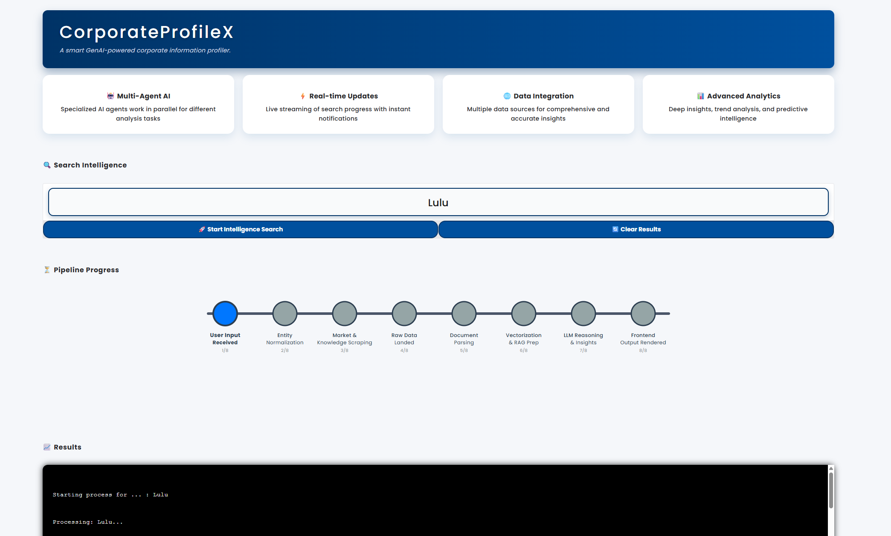

# CorporateProfileX

**CorporateProfileX** is a smart GenAI-powered corporate information profiler that provides real-time insights and advanced analytics on companies and entities. The app leverages multi-agent AI to scrape market data, perform entity normalization, parse documents, vectorize data, and generate meaningful insights using large language models (LLMs).

The intuitive UI features a metro-line style progress tracker, autocomplete suggestions, and a streaming progress log to keep users informed about the ongoing analysis steps.


*Screenshot of the CorporateProfileX user interface*
  


---

## Features

- Multi-Agent AI working in parallel for comprehensive analysis  
- Real-time streaming of search progress with instant notifications  
- Integration with multiple data sources for deep insights  
- Advanced analytics including trend analysis and predictive intelligence  
- Metro line visualization to track pipeline stages  
- Autocomplete suggestions for quick input  

---

## Installation & Setup

Make sure you have Python 3.8+ installed.

### 3.1 Clone the repository   
```bash
pip install -r requirements.txt
python app.py
```

### 3.2 Install required packages
```bash
pip install -r requirements.txt
```

### 3.3 Run the app
```
python app.py
```

---

## Usuage 

- Open the app in your browser at the URL printed by Gradio (usually http://localhost:7860
).

- Enter a company name or entity in the input box (e.g., Tesla, Elon Musk, AI Startups).

- Press the Start Intelligence Search button or hit Enter.

- Watch the metro line progress tracker and streaming log as the analysis proceeds through various pipeline stages.

- Results will be displayed in the progress log with insights and extracted data.

---

## Folder Structure

├── app.py                         # Main app entrypoint
├── ui
│   ├── landing_page_gradio.py     # Gradio UI code
│   ├── assets
│   │   └── style.css              # CSS styles for UI
│   └── services
│       └── autocomplete_engine.py # Autocomplete backend logic
├── requirements.txt               # Python dependencies
└── README.md                     # This file

---

## Notes

Ensure your environment has internet access to load Google Fonts used in the CSS.

The autocomplete suggestions backend must be properly configured for suggestions to work.

Feel free to customize the CSS in style.css for branding or visual tweaks.

---
